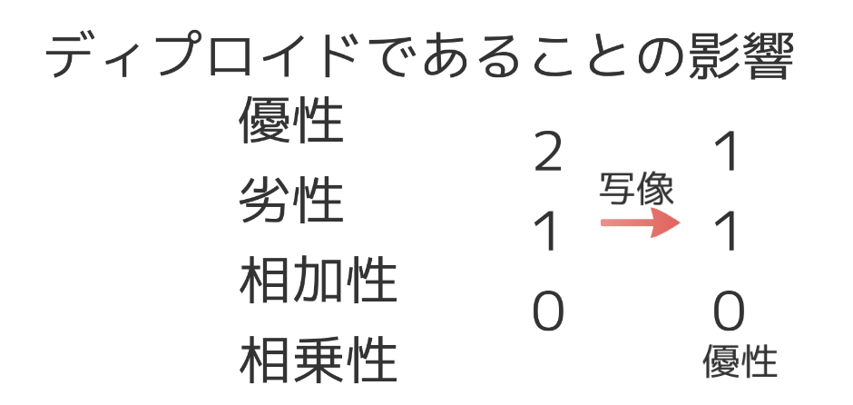
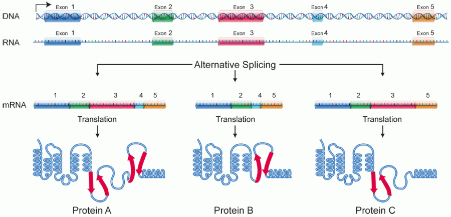
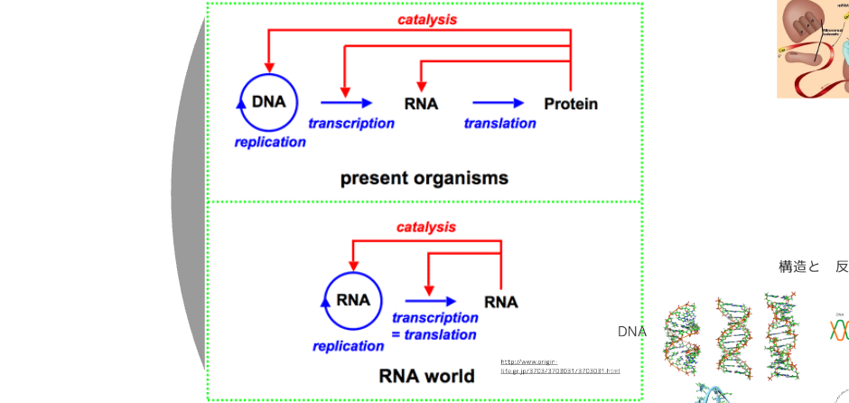

```{r setup, include=FALSE}
knitr::opts_chunk$set(echo = TRUE)
```


分子遺伝学とは〜５コマの概観

全５回
５ｘ９０＝４５０分

１ユニット１５分ｘ６＝９０分

５ｘ６＝３０ユニット

１０月２４日　メンデル遺伝学から分子遺伝学へ１
１０月３１日　同２
１２月　５日　生命の起源と進化(と分子系統学)
１２月１２日　(分子系統学と)遺伝子多型
　１月　９日　疾患の分子遺伝学


# メンデル遺伝学から分子遺伝学へ１

## 遺伝と生殖

遺伝と生殖は密接な関係ですが、それに触れる時間はないですから…

```{}
受精・妊娠・卵割・胚・発生については、「保健・性教育」の授業をきちんと受けていない履修者は、以下の二つのURLの内容を確認しておいてください。「精子　精液　トリビア」「卵子　排卵　不妊」などの検索語も有効です。医学科では、発生学、産科学などで「専門的」に学ぶ内容ですが、一般常識として、来週までに確認しておく。
```

* https://www.youtube.com/watch?v=xptl6Sn5nms　
* http://woman.mynavi.jp/kosodate/articles/78　

## 遺伝学

遺伝に関わることを表すのに、２つの異なる言葉


* Hereditary, Heredity 子が親に似ること
* Genetic, Gene 遺伝子に関すること

## 遺伝すること

* Heredity

* Heredityに関する諺

    + "https://www.google.co.jp/search?q=遺伝,諺"
    
    


### いろいろな「遺伝」

* 「親子」関係にあるときに「表現型」が「似る」

* いわゆる親子
* 「母細胞」と「娘細胞」
* 「進化上の祖先種」と「進化して生じた新種」


### 形質と表現型

* 形質 Trait

* 表現型 Phenotype

    + 「病気X」は形質、「Xである」「Xでない」は表現型
    + 「身長」は形質、「背が高い」「背が中くらい」「背が低い」は表現型、「190cm」「170cm」「140cm」は表現型

```{}
"Heredity is the passing on of traits from parents to their offspring, either through asexual reproduction or sexual reproduction; the offspring cells or organisms acquire the genetic information of their parents. " -- Wikipedia
```


## 遺伝子
* Gene

* 親子関係があると、「何かが似る」

    + 「似る」のは表現型
    + 「似る」ためには、「何か」が親から子へ渡されたのだろうと考えたときに、その「何か」が「遺伝子」

### 物理的実在としての遺伝子

    


* 親が子に伝えた「物理的実在」
    + 卵子と精子
    + 卵子内の核・精子内の核
    + DNA分子の特定の場所(座位)
    + たんぱく質コード領域
    + エクソン
    + たんぱく質をコードしないけれど「表現型に影響する」座位(非コーディング遺伝子)
    + ミトコンドリアとそのDNA


Wikibook「分子生物学」


#### 卵子と精子のミトコンドリア

* ミトコンドリアは、真核細胞の細胞小器官の１つ
* 酸素を使った効率的なエネルギー産生
* 細菌が細胞内に取り込まれて共生するようになった
    + 独自のゲノムを持つ
* 卵子はミトコンドリアをたくさんもっている。母由来のミトコンドリアが子に伝わる
* 精子はミトコンドリアを運動エネルギーのためにたくさん持っているが、受精卵には入らないので子に伝わらない


### 概念としての遺伝子

* 親から子へ伝わる
* 表現型を決める、表現型に影響する

* 「いわゆる親子」で伝わるのは「DNA分子」
* では、「進化」の場合は？
* では、体細胞分裂・分化の場合は？

### 情報と遺伝子
* 親が子に伝えたのは「情報」
* 情報とは何か
    + 「モノ」「サービス」「情報」(手術はサービス、診断は「情報提供」)
    + 「情報」は「相手に渡しても手元残る」・・・コピーできる
    + 「情報」は「受け取らなければ、その意義」を判断できない
    + 「情報」は返品できない
    + 「情報」は「一様」なときは意味がなく、「稀」なほど意義が大きい
    
* http://brevis.exblog.jp/22259031/　

* "Information is that which informs. In other words, it is the answer to a question of some kind. It is thus related to data and knowledge, as data represents values attributed to parameters, and knowledge signifies understanding of real things or abstract concepts." -- Wikipedia


### 遺伝子とは

```{}
遺伝子とは、親と子の表現型が似るという現象であるHeredityをもたらす、情報を運ぶ物理的実在のことである。その情報は１次元線状構造を持つDNA高分子が持つ４つの塩基の配列として情報が記録されていると考えられている。
```
```{}
その情報は、要素に分けることができ、情報要素は塩基配列上の特定の位置に集まっていることから、遺伝子をDNA分子の特定の領域のこととみなすこともあり、遺伝子座位と呼んだりする。
```

* この先、まだ実在としての遺伝子の定義は変わる？
    + 遺伝子の正体は歴史とともに変わってきた
    + 今後もまだ変わるか？
    + DNA配列以外にも伝達される情報はあるか？
    + 「座位」は特定の場所か？


## 有性生殖と遺伝子
### 無性生殖と有性生殖


http://www.max.hi-ho.ne.jp/lylle/seishoku1.html

#### ハプロイドとディプロイドと生活環


http://www.seibutsushi.net/blog/2007/07/241.html 

* Diploid部分が肥大した多細胞生物


## 用語の整理

* タイプがあるのは、多様性があるから

### ハプロイド・ディプロイド　１倍体・２倍体


### ジェノタイプ　遺伝子型

* $\{AA,AG,GG\}$ という常染色体の３ジェノタイプ。AA,GGはホモ接合体タイプ、AGはへテロ接合体タイプ。
* $\{AA,AG,GG\}$(female), $\{A,G\}$(male) というX染色体のジェノタイプ。Femaleは３ジェノタイプ、maleは２ジェノタイプ。

#### ホモ接合体・ヘテロ接合体


### フェノタイプ　表現型

* 離散的形質のフェノタイプ
* 連続的形質のフェノタイプ
* ジェノタイプ以外は何でもフェノタイプ
    + 個体のフェノタイプ
    + 細胞のフェノタイプ
    + 組織のフェノタイプ
    + 臓器のフェノタイプ

### アリル・ハプロタイプ
* $\{AA,AG,GG\}$ のAとGはアリル
* 染色体が持つ「タイプ」なので、「ハプロタイプ」でもある
* 染色体上に乗っている複数のバリアント座位を合わせてもハプロタイプ


## メンデルの法則・メンデル型遺伝


### 耳垢遺伝子


* https://ja.wikipedia.org/wiki/メンデルの法則 

### メンデルの法則
* 分離の法則
* 独立の法則
* 優性の法則

### メンデル型遺伝


* 核染色体
    + 常染色体性
    + 性染色体性
* ミトコンドリア染色体


### 遺伝形式


* 優性
* 劣性
* 浸透率とフェノコピー

#### 優性遺伝形式では

個人は$X \in {0,1,2}$(ジェノタイプ) のいずれかの値をとる。

個人は$Y \in {0,1}$(フェノタイプ)のいずれかの値をとる。

$X$と$Y$とには関係がある。

打点すると以下のようになる

```{r}
X <- c(0,1,2)
Y <- c(0,1,1)
plot(X,Y,pch=20,cex=3,xlab="X: Genotype",ylab="Y: Phenotype")
```

ジェノタイプとフェノタイプとの関係に関数を設定すると、することが出来るだろう。

たとえば：

$$
Y = \frac{e^{a (X-b)}}{e^{a(X-b)} + 1}
$$

この関数では、$\lim_{X\to - \infty} Y(X) = 0$, $\lim_{X \to \infty} Y(X) = 1$である。

$b$は、$Y=0.5$となる$X$の値。

$a$は、曲線の傾きを定める値。
```{r}
plot(X,Y,pch=20,cex=3,xlab="X: Genotype",ylab="Y: Phenotype")
x <- seq(from=-0.5,to=2.5,length=10000)
a <- 100
b <- 0.5
y <- exp((x-b)*a)/(exp((x-b)*a)+1)
points(x,y,type="l")


a <- 10
b <- 0.5
y <- exp((x-b)*a)/(exp((x-b)*a)+1)
points(x,y,type="l",col=2)

a <- 100
b <- 0.7
y <- exp((x-b)*a)/(exp((x-b)*a)+1)
points(x,y,type="l",col=3)
```
```{r,echo=FALSE}
plot(x,y,type="l")
points(c(0,1,2),c(0,1,1),pch=20,cex=3)
```

#### 劣性遺伝形式
$$
Y = \frac{e^{a (X-b)}}{e^{a(X-b)} + 1}
$$
上式のa,b にどのような値を設定すればよいだろうか？


### 確率事象としてのメンデル遺伝

#### 発病確率

$Y \in \{0,1\}$の値は表現型であると考えた。

別の見方をして、２つの表現型のうち、片方を発現する確率とみなすことも出来る。

その場合、ジェノタイプが0,1,2の場合に、フェノタイプ1を発現する確率が、0,1,1である場合が優性遺伝形式、0,0,1の場合が劣性遺伝形式であることになる。



一般化して、ジェノタイプごとの発現確率を$P(X=0),P(X=1),P(X=2)$とすれば(下図ではr,q,p)、

優性遺伝形式において、$P(X=1))$, $P(X=1)$という値に意味を持たせることが出来る。

* ジェノタイプからはフェノタイプが1となると予想されるが、その通りになる確率。これを浸透率と言う。

他方、$P(X=0)$は、

* ジェノタイプからはフェノタイプが0となると予想されるが、その通りにならない確率。このような現象をフェノコピー。このような確率をフェノコピーが出現する)(確)率と言う。


### 家系図


## 確率分布関数と尤度関数

* 常染色体優性遺伝形式の形質があり、ジェノタイプを$\{g_0,g_1,g_2\}$、フェノタイプを$\{p_0,p_1\}$とする。$p_1$を着目フェノタイプとする。$g_0$でのフェノコピー率をu、$g_1,g_2$での浸透率は等しく、vであるとする。ジェノタイプが$g_i$、フェノタイプが$p_j$ であるような個人の人数を$n_{ij}$とする。

* 上記の仮定の下で$N=\{n_{0,0},n_{0,1},...,n_{2,1}\}$が観察される確率は

$$
Pr(N|u,v) = \begin{pmatrix} n_{0,0}+n_{0,1} \\ n_{0,1} \end{pmatrix} u^{n_{0,1}}(1-u)^{n_{0,0}} \begin{pmatrix} n_{1,0}+n_{1,1} \\ n_{1,1} \end{pmatrix} v^{n_{1,1}}(1-v)^{n_{1,0}} \begin{pmatrix} n_{2,0}+n_{2,1} \\ n_{2,1} \end{pmatrix} v^{n_{2,1}}(1-v)^{n_{2,0}}
$$

$$
Pr(N|u,v) = \frac{(n_{0,0}+n_{0,1})!(n_{1,0}+n_{1,1})!(n_{2,0}+n_{2,1})!}{\prod n_{ij}!}u^{n_{0,1}}(1-u)^{n_{0,0}} v^{n_{1,1}+n_{2,1}}(1-v)^{n_{1,0}+n_{2,0}}
$$
この関数を、u,v(と常染色体性優性遺伝形式と)で表現された確率モデルにおける、観察Nの確率分布関数と呼ぶ。

一方、少し書き換えて
$$
L(u,v|N) = \frac{(n_{0,0}+n_{0,1})!(n_{1,0}+n_{1,1})!(n_{2,0}+n_{2,1})!}{\prod n_{ij}!}u^{n_{0,1}}(1-u)^{n_{0,0}} v^{n_{1,1}+n_{2,1}}(1-v)^{n_{1,0}+n_{2,0}}
$$
としたものを、観察Nの下での、モデルの尤度関数と言う。

この尤度関数を最大にするような、u,vを求めるには、$L(u,v|N)$を微分して
$$
\frac{\partial L(u,v|N)}{\partial u} = 0\\
\frac{\partial L(u,v|N)}{\partial v} = 0
$$
となるようなu,vを求めればよい。

より簡単には、$LL(u,v|N)=\log{L(N|u,v)}$の最大値を求めてもよい。

$$
LL(u,v|N) = C + n_{0,1}\log{u} + n_{0,0}\log{(1-u)} + (n_{1,1}+n_{2,1})\log{v} + (n_{1,0}+n_{2,0})\log{(1-v)}
$$

$$
\frac{\partial LL}{\partial u} = n_{0,1}\frac{1}{u} - n_{0,0} \frac{1}{1-u}=0\\
\frac{\partial LL}{\partial v} = (n_{1,1}+n_{2,1})\frac{1}{v} - (n_{1,0}+n_{2,0}) \frac{1}{1-v}=0
$$

$$
u = \frac{n_{0,1}}{n_{0,0}+n_{0,1}}\\
v = \frac{n_{1,1}+n_{1,2}}{n_{1,0}+n_{1,1}+n_{2,0}+n_{2,1}}
$$

* つまらない結論？

* 標本の「発現割合」は、「尤度を最大にする発現率の推定値＝最尤推定値」

* 遺伝形式・浸透率・フェノコピーが不明なとき、複数のモデルにて推定を行い、どちらが尤もらしいかを推定する


## 練習問題(試験にそのまま出る可能性があります)
* HereditaryとGeneticの異同について説明しなさい
* 遺伝子とは何か、その物質的側面と情報的側面との両方に言及して説明しなさい
* 常染色体性優性遺伝形式の遺伝的形質について、責任アリルのホモ接合体の浸透率をu2、ヘテロ接合体の浸透率をu1とし、フェノコピー率をvとしたときの、３つのジェノタイプのそれぞれの表現系の発現確率を式で示しなさい
* $Y = \frac{e^{a (X-b)}}{e^{a(X-b)} + 1}$ この関係を仮定し、$P(X=0)=r,P(X=1)=q,P(X=2)=p; r \le q \le p$と、$a,b$との関係がどうなるか示せ。

```{r,echo=FALSE}
r <- 0.1
q <- 0.9

a <- log((1-r)*q/(r*(1-q)))
b <- 1/a * log((1-r)/r)
X <- 0:2
p <- exp((2-b)*a)/(exp((2-b)*a)+1)
Y <- c(r,q,p)
plot(X,Y,pch=20,cex=3,xlab="X: Genotype",ylab="P(X)",ylim=c(0,1))
x <- seq(from=-0.5,to=2.5,length=10000)

y <- exp((x-b)*a)/(exp((x-b)*a)+1)
points(x,y,type="l")
```


# メンデル遺伝学から分子遺伝学へ２
## 遺伝情報を持つ分子

### DNA
* DNA高分子
* 直鎖状分子
* 4塩基 A,T,G,C
### 遺伝子座位

* 情報が記録(コード)されている
* 特定の領域にコードされている。遺伝子座位という
* コードは読みだされて機能する
    + mRNAを経てタンパク質として読みだされる
    + 機能性RNA分子として読みだされる


### DNA、RNA、たんぱく質
#### 転写と翻訳、生成と分解

* 転写
* スプライシング
* 翻訳
* コドン
* 翻訳後修飾


## ゲノム

* 遺伝子とは情報
* 遺伝子座位は、情報の断片が、DNA分子の特定の位置に局在していることを指す
* ゲノムは情報全体


$$
Genome !\ne \sum_i geneLocus_i
$$

```{}
ゲノム・アプローチとは、局在する遺伝子座位の和で説明できない、遺伝情報を読み解こうとする態度
```

* 優性・劣性遺伝形式も「和で説明できない」ことの一つ
* 複数の遺伝子座位の協働効果〜複合遺伝性疾患
    + 組み合わせ $2^n = \sum_i \begin{pmatrix}n\\i\end{pmatrix} = 1 + n + \frac{n(n-1)}{2} + ... + n + 1$
* 遠位座位の近接関係


http://leading.lifesciencedb.jp/4-e002/

## オミクス

* ゲノム
* エピゲノム
* トランスクリプトーム
* プロテオーム
* メタボローム
* フェノーム


### エピゲノム
* DNA、ヒストン、クロマチン、染色体


* 化学修飾
    + メチル化
    + ヒストン複合体とその化学修飾
* 構造の緩み
    + DNAの不活化
    + ヘテロクロマチン、ユークロマチン


 


* 「エピゲノム」は、「各所」の「エピジェネティクス」を単なる和ではなく、「全体」で考えあること

* 遺伝子の不活化
    + X染色体モザイク。女に２本あるX染色体のうち１本は不活化されている(Lyonization)
    + Barr小体
    + iPS細胞
    


 DNA methylation pattern of the paternal H19/IGF2 DMR in hybrid fibroblasts (somatic cell) and induced pluripotent stem (iPS) cells. Front. Genet., 25 February 2015 | https://doi.org/10.3389/fgene.2015.00058
 
### トランスクリプトーム

### タンパク質コーディング遺伝子のトランスクリプトの多様性

* スプライシングバリアント

* 大部分の遺伝子で認められる





#### 発現比較解析
* > 20000遺伝子の発現量を同時測定
* 発現パターンで分類


### 機能性RNA遺伝子、ノンコーディング遺伝子

* (mRNA): タンパク質へ
* tRNA
* rRNA
* ncRNA
* snRNA
* snoRNA
* microRNA
* その他


## 分子遺伝学における数

* 細胞の数 38兆個(30兆個は赤血球)
* 核染色体(22対の常染色体、1対の性染色体)
* ヒトゲノムDNA配列塩基対数 約　32億塩基対
* たんぱく質をコードする遺伝子数　約 20000個
* たんぱく質コード領域 2%
* ミトコンドリアゲノムの遺伝指数 37個
* 2ハプロイドセットの塩基一致割合 99.6 %

* https://publications.nigms.nih.gov/insidelifescience/genetics-numbers.html 


https://doi.org/10.1371/journal.pbio.1002533

## ネットワークとパスウェイ

* ゲノム。遺伝子全体で考えたい
* 個々の遺伝子(遺伝子座位)は細切れにすぎる
* 全体は大きすぎる
* 遺伝子をサブセットにする
    + 機能によるサブセット化
    


## 時空間


* ゲノムは、受精卵から死ぬまで、時間的にも、空間的にも、「同一」
    + ただし、実際は、テロメア短縮があり、体細胞系変異もあり、それらの影響を受ける
    + 基本情報は、一生に一度の解析で可
    + 個々の細胞について解析することが必要になることも(免疫細胞・癌細胞の変化など)
* エピゲノム・トランスクリプトーム(その他オーム)は細胞の分化に重要。時間・空間的に多彩
    + たくさんの時刻、たくさんの場所で測ることで、はじめて全容がわかる
    + たくさんの細胞をまとめて測ることもできるし、個々の細胞を調べることもできる
    


# 生命の起源と進化と分子系統樹


## 生命とは

### 生命とエントロピー

#### エントロピーと熱力学の法則

    + 放っておくと均一になる
    + 無秩序になる
    + 変化は一方向的、不可逆的
    + 微視的状態 w について

$$
S = - k\sum_w p(w)\log{p(w)}
$$


####　情報とエントロピー

    
$$
H(X) = - \sum_w p(w) \log{p(w)}
$$
コイン投げのエントロピー 
$$
-(p\log{p} + (1-p)\log{(1-p)})
$$


```{r,echo=FALSE}
p <- seq(from=0,to=1,length=101)
p <- p[-1]
p <- p[-100]
H <- -(p*log(p)+(1-p)*log(1-p))
plot(p,H,xlab="p",ylab="エントロピー",type="l")
```

治療法の成否のエントロピー。成功s回、失敗f回。推定成功率pは
$$
f(p) = \frac{(s+f+1)!}{s!f!}p^s (1-p)^f
$$

$$
-\int_{0}^1 f(p)\log{f(p)}dp
$$

新治療法であって、成否情報がない場合(s=0,f=0)と、(s=10,f=8)の場合では、治療法について情報が増えているから、エントロピーが負になっている。


```{r,echo=FALSE}
s1 <- 0
f1 <- 0
F1 <- dbeta(p,s1+1,f1+1)
s2 <- 10
f2 <- 8
F2 <- dbeta(p,s2+1,f2+1)
matplot(p,cbind(F1,F2),type="l",xlab="p",ylab="f(p)",main="治療法の成功率推定分布")
```

```{r,echo=FALSE}
matplot(p,cbind(-F1*log(F1),-F2*log(F2)),type="l",xlab="p",ylab="-f(p)log(f(p))",main="治療法の成功率推定分布に相当する-f(p)(log(f(p)))")
```


#### 生命とエントロピー

* 生物はエネルギーを消費して(光合成、食物消化)、特別な状態を維持している。エントロピーが増大しない状況を維持している系


### 生命とは
* 生命の基本要素
    + 再生産(コピー)
    + 物質・情報の受け渡し
    + 多様性
    + 確率的変化
* 分子の役割
    + 再生産：DNAをコピー機能のあるタンパク質が実現
    + 物質・情報の受け渡し：DNAを生殖機能で受け渡し。生殖機能はタンパク質等が構成する「生体」が実現
    + 多様性：DNA配列多様性、遺伝子産物の多様性(RNA、タンパク質の多様性)
    + 確率的変化：変異、遺伝的浮動、交叉、メイティング


## 生命の起源


### RNAワールド仮説

* RNAだけで、生命の要素が実現できる
* RNAは機能性分子であり、情報性分子でもある
    + RNAの塩基配列＝遺伝情報(コピーができて多様性も持てる)
    + RNAは高次元構造を取り、酵素活性がある
* 現在のDNA、RNA、タンパク質は、分業体制とみなせる





## 進化

* 約４０億年前にスタート
* 種分化、種内変化、絶滅


### 系統樹


### 種分化


### 自然選択説

* 表現型レベルでは、環境に適した個体が増える。その表現型をもたらす遺伝子型が増える
* 選択、淘汰、選択圧
* 適応
* 共進化
    + 「適応する」ことが単純ではない

### 中立進化説

* 分子レベルでの遺伝子の変化は大部分が自然淘汰に対して有利でも不利でもなく（中立的）、突然変異と遺伝的浮動が進化の主因であるとする説


* https://en.wikipedia.org/wiki/Motoo_Kimura 

#### 分子時計

* "分子時計は、言い方を変えれば、分子進化速度の一定性である。この結果は中立説で容易に理解できる。中立説によると、分子進化速度ｋは総突然変異率μに対する中立な突然変異の割合ｆに比例する。"
https://www.brh.co.jp/research/formerlab/miyata/2005/post_000003.html#04


### ほぼ中立進化説


* "中立説では自然淘汰の影響を受けない完全な中立突然変異に主題を置き、進化速度は集団サイズとは相関がなく、中立突然変異率に等しくなると論じた。 一方、ほぼ中立説では集団サイズと分子進化速度の相関を予想している。簡単に説明すれば、遺伝的浮動は弱有害突然変異を集団中に固定する力であるが、大きい集団では遺伝的浮動の効果は弱い。ゆえに、大きい集団では小さい集団よりもゆっくり進化が進むということである。"Wikipedia「分子進化のほぼ中立説」

### 遺伝的浮動

* 集団中のアリル頻度は偶然の要素で上下する
* 場合によっては、片方のアリルが集団から消滅する(もう片方が集団に固定する)
* 頻度の増減、消滅は集団が小さいほど起きやすい
* 固定するアリルは必ずしも『有利』なそれとは限らない
* 進化は小集団の方が速い


* 有限個体数集団なら浮動

* 無限近似は拡散方程式
    + 無限近似の下では、頻度fのアリルがある時間tの後に、頻度f'になる確率は、拡散方程式で表される


#### 雑談：量子力学の必要性

* 生命現象は無限近似してよい場合と、そうするとわからなくなることとが混ざっている
* 古典力学と量子力学との両方が必要
* 古典と量子との境界が曖昧

### 変異、遺伝的浮動と集団のサイズ

* 全部でN個のボールが入っている袋がある。白いボールがNw個、赤いボールがNr個(Nw + Nr = N)。今、この袋から、１つずつボールを取り出してはもとに戻すことをN回繰り返し、白赤のボールの個数Nw',Nr'を記録する。記録したのち、白いボールNw'個、赤いぼるNr'個(Nw'+Nr'=N)を入れた新しい袋を作る。新しい袋に対して、同じことを実施する。それを繰り返す。

* Nw=1,Nr=1の袋からスタートし、次の時点の袋がNw'=0,Nr'=2になる確率を求めよ

* Nw=1,Nr=1の袋からスタートし、次の時点の袋に「多様性がなくなる(白のみ、もしくは赤のみ)」確率を求めよ

* Nw=1,Nr=1のからスタートし、袋の更新を３回行った時点で「多様性がなくなる」確率を求めよ

* Nw,Nrの袋から、Nw',Nr'の袋に変化する確率を説明せよ


## 配列の比較

### 遺伝的距離


* １点変異の距離を１とする
* マンハッタン距離は、点変異の個数
* 点変異の起きる確率が一定とすると、マンハッタン距離は、種分化からの時間に比例する

### 距離

* 多様性の学問である生物学において、ものの異同を数値にすることは重要
* ２つのものの異同を数値化し、同じもの同士を0にするものを「距離」と言う
* ユークリッド距離はその１つ
* マンハッタン距離もその１つ


### クラスタリング


#### クラスタリング〜機械学習


### アラインメント

* 配列合わせ(アラインメント)は難しい計算機課題


### 種間配列比較


* アミノ酸配列とDNA配列

* バイオインフォマティクス・情報学の『最適化』一大分野


* 生命自体が、巨大な最適化系


* https://www.youtube.com/watch?v=oKcvsgIQOt0 

### 配列の似た遺伝子、ホモログ・パラログ・オーソログ

* 遺伝子重複→パラログ
* 進化→オーソログ


* http://schaechter.asmblog.org/schaechter/2009/03/of-terms-in-biology-ortholog.html　

### シンテニー

* 染色体単位で種間の対応がある


* BMC Bioinformatics20078:82 DOI: 10.1186/1471-2105-8-82

## ゲノム進化

* 遺伝子重複
    + 使える遺伝子があったら
    + そのコピーも使える
    + そのコピーを少し変えたものも使える
    + コピーがあれば、試しに変えてみて失敗しても大丈夫
    + 偽遺伝子(psuedogenes)
    


* 全ゲノム重複

* 二倍になる、三倍になる


* トランスポゾン
    + ウイルスは自身の核酸配列をホストの配列に挿入する
    + それがあちこち移動する
    + 移動するためのカット・アンド・ペースト機能付き


* エクソン・シャッフリング
    + 使える遺伝子を使いまわすのもよいが
    + 使えるエクソンを使いまわすのもあり
    


### 粗大な変化・微小な変化
* 大きな変化
    + 種分化
* 小さな変化
    + 種内変化(種内遺伝的多様性)
    + 蓄積することで、種分化にもつながる
* 小さな変化のタイプ
    + 点変異
    + 小挿入・欠失
    + 繰り返し
    + 逆位

# 遺伝的多様性
## 遺伝的バリアント
### 3つの違い
* 種間
* 種内
* 個体内


### 種内遺伝的多様性の由来

* 種間
    + 生殖細胞系変異
    + 遺伝的浮動
* 種内
    + 生細胞系変異
    + 遺伝的浮動
    + 交叉・組換え
* 個体内
    + 体細胞変異

### DNA 二重鎖　二倍体


### バリアントの分類
* 置換
* 欠失・挿入
* リピート
* 逆位
* 転座


* 大小さまざま
    + １塩基対単位：一塩基多型(一塩基バリアント、SNP,SNV)、一塩基挿入・欠失など
    + ２…塩基対単位：普通の配列実験とアラインメントで見つけアレル
    + 1000塩基対単位：普通の配列実験とアラインメントでは見つけにくい。構造バリアント.、コピーナンバーバリアント
    + 巨大なバリアント：HLA領域(100万塩基対)
    + 超巨大バリアント：染色体単位(X染色体２つ vs. X染色体とY染色体。21番トリソミー)


* 呼び方
    + 多型・ポリモルフィズム(集団中に『ふつうに』存在するバリアント。『ふつうに』の基準として、1%を採用することもある)
    + バリアント(もっとも一般的な呼称。一様でなければなんでもバリアント)
    + レア・バリアント(多型に対して、それより集団中アリル頻度が低いもの。低さは1%とすることもあれば、もっと低いものを指すこともある)
    + 変異・ミュータント・Mutant(ごく低頻度のバリアントを指すことが多い。特に、機能影響が知られているものを指すことも多い)
    + バリアント・多型は遺伝的多様性のある座位を指すことが基本。そこにある、個々の配列はアリルと呼ぶことが基本。ただし、集団内頻度が低いアリルを指して、バリアントと呼んだり、変異と呼んだりすることもある

* 一塩基バリアントの数(ヒト)
    + 百塩基対くらいに１つくらいの割合でゲノム全体にある
    + ２つの染色体セットを比べると、平均数百塩基対に1か所で違いが見つかる

### 集団内遺伝的多様性の構成３要素
* 変異
* 遺伝的浮動
* 交叉・組換え


## 種内遺伝的多様性の評価
### ハーディ・ワインバーグ平衡と不平衡

* Hardy-Weinberg 平衡
    + 集団中にバリアントがあって、アリル頻度が$p,1-p$であるとする
    + 常染色体上のバリアントであり、その集団でランダムメイティングが実現しており
    + 3ジェノタイプの生存がジェノタイプによって変わることがないのであれば
    + 3ジェノタイプの集団内頻度は、$p^2,2p(1-p),(1-p)^2$になる

* Hardy-Weinberg 不平衡
    + ランダムメイティングしていないことは多い(社会的因子等)。その場合、ホモ接合体の割合が$p^2+(1-p)^2$よりも大きくなる。Hardy-Weinberg不平衡と言う
    + 新たなアリルが集団外部から流入してきた場合、集団内に広くランダムにいきわたるには時間がかかるから、タイムラグによるHW不平衡もある
    + ランダムメイティングしていても、標本を取って調べると、$p^2,2p(1-p),(1-p)^2$からずれることがある
    + 「平衡」というのは、「因子が独立を仮定したときの状態」のこと
    + 「独立」を過程したときの、確率の計算は、掛け算なので $(p+(1-p))^2 = p^2 +2p(1-p)+(1-p)^2$ がHW平衡
    
### 連鎖
* メンデルの独立の法則は、「異なる染色体上の２座位が独立に振る舞う」ことを言う
* 同一染色体上の２座位は、「非独立」
* 交叉・組み換えがなければ、同一染色体上の２座位は相互に完全に拘束されている
    + 拘束されている、とは、第１座位のアリル(A,a)と第２座位のアリル(B,b)があったときに、A-Bというハプロタイプを持つ染色体と、a-bというハプロタイプを持つ染色体とを持つ親からは、A-Bというハプロタイプか、a-bというハプロタイプしか、子には伝わらないことを言う
* 実際には交叉・組み換えがあるので、同一染色体上の２座位は、近ければ近いほど、相互拘束関係が強く、遠ければ拘束関係が弱い


### 連鎖不平衡

* 新しいアリルの誕生
* 交叉・組み換えにより、アリル間の拘束が緩む
* 染色体上で近いバリアント間では拘束が緩みにくい(緩むのに時間がかかる)
* バリアントが誕生してから時間が経つほど拘束が緩む
* 拘束の強さを集団中の A-B, a-b, A-b, a-B の割合で測る
* その評価を連鎖平衡・不平衡と呼ぶ
* 平衡とは、独立(拘束がない)状態を指し、A-B,a-b,A-b,a-Bの割合が、$(pA + pa) \times (pB+ pb) = pA\times pB + pA \times pb + pa \times pB + pa \times pb$ に従っている状態に相当する


## 人類の歴史


* 機能性遺伝子バリアント


# 疾患の分子遺伝学

## 病理

* 疾患の原因・発生メカニズムの解明、診断をするのが、病理学。歴史的経緯から、解剖、組織・細胞の顕微鏡観察に重きを置く

* 疾患の分子遺伝学は、疾患の原因・発生メカニズムを遺伝子との関連で解明すること、また、遺伝子関連分子の解析を通じて診断すること

* 観察に重きを置くのは「フェノタイプ」に基づく病理解釈、遺伝子に重きを置くのは「ジェノタイプ」に基づく病理解釈

* ジェノタイプとフェノタイプは確率的に繋がることから、疾患の分子遺伝学では、原因・発生メカニズムが「確率的・統計的」に説明される


## 疾患とフェノタイプ

* 疾患の診断は、フェノタイプを{0,1}={病気でない,病気である}に分ける

* 疾患を連続値で表すこともある。高血圧、高コレステロール血症

## 疾患の原因と疾患のリスク

* 原因
    + (いつもは遅刻しないが、今日は)自転車のタイヤがパンクしたので、遅刻した。パンクは原因。
    + あるアリルのホモ接合体であると、ある疾患を(必ず)発病する。このアリル(のホモ接合体であること)は原因

* リスク
    + 始業１分前に講義室に到着するようにしているが、今日は自転車のタイヤがパンクしたので、遅刻した。１分前到着の習慣は「リスク」。パンクは原因
    + 自転車は雨ざらしで錆びついており、ブレーキもいまいちだったりチェーンもガタガタしているが、壊れたら修理しようと思っていたところ、今日に限ってチェーンが外れたので、遅刻した。雨ざらしにするのはリスク。壊れたら修理するという方針もリスク。チェーンが外れたのは原因？

* 原因かリスクか
    + 心臓の血管(心血管)が血栓で詰まったので、心筋梗塞(心臓の筋肉の一部が壊死することで心機能が低下すること)となった(と診断された)。心臓の一部が壊死したことは原因？血管が詰まったこと・血栓は原因？
    + 心血管は年齢とともに硬く狭くなることがふつうであり、狭い血管は小さな血栓でも詰まりやすい。血管が硬いことはリスク？年齢はリスク？糖尿病になると血管が細くなりやすい。糖尿病はリスク？


    
* 遺伝因子は原因かリスクか
    + あるアリルのホモ接合体であると、ある疾患を(必ず)発病する。このとき、このアリルは原因アリル。この座位は、原因座位。
    + ある座位のジェノタイプがmm, Mm, MMの場合のそれぞれにおける発病率が、0.5%、1%、1.6%である。アリルMはリスクアリル。この座位はリスク座位。

* 原因とリスクとの境界は曖昧
    + 優性遺伝形式であるが、浸透率は60%。このアリルは原因か？
    + 優性遺伝形式であるが、浸透率は60%で、アリルを持たない場合のフェノコピー率は30%。このアリルは原因か？
    
* 因果関係と関係
    + AとBとに関連があり、AがBの原因であるときは因果関係
    + AとBとに関連があり、AがBの原因ではないとき(BがAの原因でもないとき)はただの関係
    + AとBとが因果関係であって、AがBの原因であるとき、AはBよりも時間的に先にある
    + AがBの「原因」であるときに認められるAとBとの関係は因果関係
    + AがBの「リスク」であるときに認められるAとBとの関係は、『原因』とは言い難いが、かといって、ただの関係とも言い難い。「ただの関係」ではなく、「因果(関係的特徴を持った)関係」
    + 遺伝因子は受精卵から保有しており、いかなる表現型の出現に先立つから、遺伝因子がもたらす「リスク」は「因果(関係的特徴を持った)関係」
    + ゲノムは「先立つ」。「エピゲノム・トランスクリプトーム他、ゲノム以外」は「先立」っているかどうか不明である。したがって、疾患Xの発病とあるジェノタイプとに関連が認められれば、ジェノタイプは発病に先行している。疾患Xの発病とある遺伝子の発現量とに関連が認められても、発現量の増加は発病に先行していたのか、発病したから増加しのかわからない。発現量の増加が発病に先行していたとしても、それが、疾患Xの「予兆」だったのか「原因・リスク」だったのかもわからない


因果はそもそも難しい哲学的課題


分野によって異なる捉え方をする(Wikipedia En)


    


## 遺伝因子と環境因子

* あるジェノタイプだと必ず発病する。遺伝因子が100%。遺伝率が100%
* あるジェノタイプだと発病しやすいが、必ずそうとは限らない。遺伝因子ありとする。遺伝率が0%と100%との間であるとする。遺伝因子があるのに発病するかしないかにばらつきが出ているが、そのばらつきを環境因子であるとみなす
    + ここで言う環境因子には、『観測されうる具体的な因子』も含むが、『偶然性』と呼ぶべき確率的要素も含める(ことが多い)
    + 『スギ花粉症は、リスク遺伝子と言う遺伝因子と、地域のスギ花粉の存在・量という環境因子、個人の生活スタイルという環境因子と、(偶然性と)で決まる』
    
## 疾患の遺伝性


### 単一遺伝性疾患と複合遺伝性疾患

* 単一遺伝性疾患
    + メンデル型遺伝病
    + (偶然性を含む)環境因子の寄与程度に強弱あり
* 複合遺伝性疾患
    + 原則として、複数の遺伝因子、(偶然性を含む)複数の環境因子

####複合遺伝性疾患の亜分類

* 遺伝因子の数・リスク遺伝子の数で分類
    + リスクをかなり強く(数倍程度)上げる遺伝子が数個のもの
    + リスクをやや強く(1.3倍、とか)上げる遺伝子が10個〜数十個程度のもの
    + 個々の遺伝子のリスク上昇度は小さいがたくさん(100個超とか)あるもの
    + リスク遺伝子の数が少ないほど、家系内集積性が高く、家系図がいわゆる遺伝病的に見える
    + 高リスク遺伝子があるほど、家系図が遺伝病的に見える
    
* 遺伝リスクの高さ
    + リスクが数倍に上がる程度だと、それほど「遺伝病」的には見えない
    + メンデル型遺伝病の場合のリスク上昇は、100000倍、無限大倍、など
    + 特定の疾患の中に、とりわけ、リスク上昇程度が強い遺伝子が存在する場合がある。たとえば、乳癌。乳癌は「やや強い」遺伝子が多数あるのが通例だが、ごくわずかな遺伝子がリスクを数十倍上昇させる。このような場合には、その特定の遺伝子が引き起こす乳癌と、それ以外の乳癌とを、「遺伝的背景の面で異なる疾患」として捉える
    
#### 優性・劣性・相加モデル(単座位)

* ジェノタイプ mm,Mm,MMの重みを 0,0.5,1とするモデル
* 優性モデル(0,1,1)と劣性モデル(0,0,1)との中間的なモデル
```{r}
X <- 0:2
Y <- X * 0.5

plot(X,Y,pch=20,cex=3,xlab="X: Genotype",ylab="Y: Probability to develpt disease")
x <- seq(from=-0.5,to=2.5,length=10000)
a <- 100
b <- 0.5
y <- exp((x-b)*a)/(exp((x-b)*a)+1)
points(x,y,type="l")
points(1,1,pch=20,cex=2,col=4)

a <- 10
b <- 1
y <- exp((x-b)*a)/(exp((x-b)*a)+1)
points(x,y,type="l",col=2)
points(1,1,pch=20,cex=2,col=4)

a <- 100
b <- 0.7
y <- exp((x-b)*a)/(exp((x-b)*a)+1)
points(x,y,type="l",col=3)
points(1,1,pch=20,cex=2,col=4)

```


### 複数座位

* 因子の数が増えると正規分布化する
* 極端(超低リスクと超高リスク)は少なく、そこそこが多くなる

#### 複数座位での相加モデル
* 複数座位で(簡単のために)相加モデルを想定する。現実とそれほど遠くないかもしれない
    + 各座位のアリルのそれぞれにリスク値を与え、保有アリルのリスク値の和を、総リスクとするモデル

```{r,echo=FALSE}
n.loci <- 50
r <- runif(n.loci) * 0.2 + 0.4
r <- rep(r,each=2)
f <- runif(n.loci)*0.2 + 0.4
f <- rep(f,each=2)
N <- 10^5
X <- matrix(0,N,n.loci*2)
for(i in 1:(n.loci*2)){
  X[,i] <- sample(0:1,N,replace=TRUE,prob=c(1-f[i],f[i])) * r[i]
}
n.loci.tmp <- 1
R <- apply(X[,1:(n.loci.tmp*2)],1,sum)
hist(R,main=paste("No. loci=",n.loci.tmp),xlab="Risk",ylab="人数")
```

```{r,echo=FALSE}
n.loci.tmp <- 2
R <- apply(X[,1:(n.loci.tmp*2)],1,sum)
hist(R,main=paste("No. loci=",n.loci.tmp),xlab="Risk",ylab="人数")
```
```{r,echo=FALSE}
n.loci.tmp <- 3
R <- apply(X[,1:(n.loci.tmp*2)],1,sum)
hist(R,main=paste("No. loci=",n.loci.tmp),xlab="Risk",ylab="人数")
```
```{r,echo=FALSE}
n.loci.tmp <- 10
R <- apply(X[,1:(n.loci.tmp*2)],1,sum)
hist(R,main=paste("No. loci=",n.loci.tmp),xlab="Risk",ylab="人数")
```

* 正規分布に従う量的形質は多い
* それらには多因子が想定される
    + 身長は遺伝性が高い
    + 身長は正規分布に従う
    + 身長には多数の遺伝因子が知られている


## 閾値モデル

* 表現型自体が正規分布(様)に分布することもあれば、疾患リスクがそのように分布することもある
* 遺伝因子からのリスクと環境因子(偶然性を含む)からのリスクとの和が閾値を超えると発病するとするモデル
    + 遺伝因子だけでも正規分布様(黒)
    + 環境因子が加わると右にシフトする
    + 環境因子が加わることでリスクのばらつきが大きくなっている
    + 発病はリスクの和が閾値(赤線)を超えることとみなすと、環境因子が無ければ発病する人は(ほとんど)いないのに対して、環境因子が加わることで発病する
```{r,echo=FALSE,warning=FALSE}
E <- rnorm(N,mean(R)*0.5,sd(R)*0.5)
E <- E - min(E)
W <- R + E
H <- hist(c(W,R),plot=FALSE)
hist(R,main=paste("No. loci=",n.loci.tmp),xlab="遺伝因子リスクと全リスク",ylab="人数",breaks=H$breaks,xlim=c(0,max(W)*1.1),ylim=c(0,max(H$counts)),density=25)
hist(W,add=TRUE,col=3,density=17,breaks=H$breaks)
abline(v= quantile(W,0.9),col=2)
```


* 遺伝リスクと発病との関係
    + 遺伝リスクが大きいほど発病率は高い
    + 遺伝リスクと発病の関係は確率的
    
```{r,echo=FALSE,warning=FALSE}
Ph <- as.numeric(W>quantile(W,0.9))

plot(R,jitter(Ph,0.1),pch=20,cex=0.1,xlab="遺伝リスク",ylab="発病")

lm.out <- glm(Ph ~ R, family = binomial)
ord <- order(R)
points(R[ord],lm.out$fitted.values[ord],col=2,type="l")
```

* 閾値モデルでは、全リスク(遺伝リスク＋環境リスク(偶然性を含む))と発病の関係は決定的

```{r,echo=FALSE,warning=FALSE,error=FALSE}
Ph <- as.numeric(W>quantile(W,0.9))

plot(W,jitter(Ph,0.1),pch=20,cex=0.1,xlab="遺伝+環境リスク",ylab="発病")

lm.out <- glm(Ph ~ W, family = binomial)
ord <- order(W)
points(W[ord],lm.out$fitted.values[ord],col=2,type="l")
```


#### マルチヒットと閾値

* 複数の因子は必ずしも初めから揃っているわけではない
* 複数の体細胞変異が蓄積することで細胞が癌化すると考えると、癌の発症年齢の仕組みが理解できる
* マルチヒットモデル


中年以降に発症するモデル

```{r,echo=FALSE}
age.max <- 120
R <- matrix(sample(0:1,N*age.max,replace=TRUE,prob=c(0.9,0.1)),ncol=age.max)
cumsumR <- t(apply(R,1,cumsum))
aff <- apply(cumsumR,2,function(x){length(which(x>10))})
plot(1:age.max,aff/N,type="l",xlab="年齢",ylab="発病者割合",main="加齢による発病者の増加")
```

死も、マルチヒットと考えれば、誰もが「発病〜死」する

```{r,echo=FALSE}
age.max <- 120
R <- matrix(sample(0:1,N*age.max,replace=TRUE,prob=c(0.6,0.4)),ncol=age.max)
cumsumR <- t(apply(R,1,cumsum))
aff <- apply(cumsumR,2,function(x){length(which(x>33))})
plot(1:age.max,aff/N,type="l",xlab="年齢",ylab="死亡者割合",main="死亡者の増加")
```

## 遺伝的バリアントと機能異常・機能破綻

* 常染色体ジェノタイプにはmm,Mm,MM
* 2本で仕事ができればよいが
* 1本では回らない仕事もある
* 1本で回ることが多いが、繁忙期には回らない仕事もある
* 繁忙期は人生の時期(受精卵から死ぬまで)のどこかで訪れるかもしれない
* 繁忙期は特定の場所(臓器・組織・細胞)に訪れるかもしれない
* 繁忙期は環境因子の変化で訪れるかもしれない(細菌が入って来た、睡眠不足だ、栄養状態がおかしい)
* 2本で仕事をすればよいが、似た仕事のできる別の誰かが助けてくれるかもしれない
* 2本の事情は普通は受精卵から変わらないが、変わることもある。1本に体細胞変異が入って、2人の関係はがらりと変わるかもしれない


### 機能影響

* 発現産物の質と量
* 発現産物がタンパク質の場合(タンパク質コーディング遺伝子)
* 発現産物がRNA分子の場合(ノンコーディング遺伝子、機能性RNA遺伝子)

### タンパク質コーディング遺伝子

* コーディング：アミノ酸置換
* 転写
* スプライシング
* 翻訳
* 翻訳後修飾
* 分解


* エクソンとイントロン
* スプライシング
* UTR
* 転写調節領域　プロモータ


#### エクソンのバリアント
* SNP(点変異)はコドンを変える
    + コドンが変わると、アミノ酸が変わるかもしれない
    + Non-synonymous (アミノ酸置換あり) vs. Synonymous (アミノ酸置換なし)


* アミノ酸置換
    + アミノ酸の変化は、アミノ酸の化学特性と関係がある(ペプチド高次構造への影響)
    + アミノ酸は翻訳後修飾によって重要な機能を発揮しているかもしれない


* フレームシフト

フレームシフトが起きると、バリアント箇所とそれより下流に多くのアミノ酸置換が起きる。終止コドンの移動も起きる


#### 転写調節
    + 転写効率は転写調節領域への転写関連分子の結合によって変化する
    + 転写調節領域への分子の結合は調節領域配列依存的
    + 転写調節領域のバリアントは、転写活性に影響し、発現機能に量的に影響する
    


* 転写調節配列には分子結合にとって重要な塩基とそうでない塩基がある
    + 重要な塩基は種を超えて保存されている(種間多様性が小さい)
    + 保存性の強さによって、重要塩基を測る
    + 変異アリルの機能的重要性の予測に活用することもできる
    


#### イントロンのバリアント
    + スプライシング調節配列がある
    + 特にエクソン隣接塩基
    + スプライシングに影響すると、スプライシングバリアントの発現パターンに影響する
    + スプライシング以外にも転写調節に影響することもある


### ノンコーディング遺伝子

* RNA遺伝子の機能
    + RNA高次構造が機能を持つ
    + RNA塩基配列が、配列特異的機能を持つ
    


## 生殖細胞系列と体細胞系列

* 次世代への情報伝達のための生殖細胞系列
* 自世代内で完結する体細胞系列


### 生殖細胞系列の変異

* do novo変異アリルは、親から子、子から孫へ伝わる変異アリルではなく、親世代にはなく、子の生殖細胞系列で新規に(de novo)おきた変異イベントによって誕生した新規アリルが、孫に伝わり、孫の全細胞(生殖細胞系列を含む)が有することになるアリル
* その孫からひ孫世代に伝わるかどうかは、そのアリルを持った配偶子が受精卵となるかどうかで決まり、確率的


### 体細胞系列の変異と癌

* 癌細胞は細胞増殖のコントロールに異常を来たし、周囲と調和せずにどんどん増えるような細胞
* 細胞増殖は破綻しないように、複数の仕組みで制御されている
* 体細胞変異がおきて、その仕組みに異常が発生しても変異を修復する機構もある
* それらの多重の防止機構を突破した結果、癌細胞となり、癌という病気をもたらす


* 癌細胞以外にも、多くの細胞で体細胞系列変異は起きている。癌が目立つのは、癌細胞が「増殖」するから

### 体細胞モザイク

* 生得的な特徴を持つ体細胞系列変異がある
* 受精卵の成立以降、出生前に起きる変異
* それは、「親の体細胞にはない」という意味でde novo変異に近い
* 赤ん坊として生まれたときには、すでに持っていると言う意味で「生得的」
* 特に、受精卵から卵割して行く途中であって、器官発生より前の段階に起きる体細胞変異は、身体のある割合の細胞に変異を入れることから、「体細胞変異のモザイク」を作る
* メンデル型遺伝病の原因変異の場合には、「全部の細胞ではなく、ある割合の細胞」が病的であるため、軽症の疾患・様子の異なる疾患として現れることがある


## まとめ

* テキストの目次を確認すること

